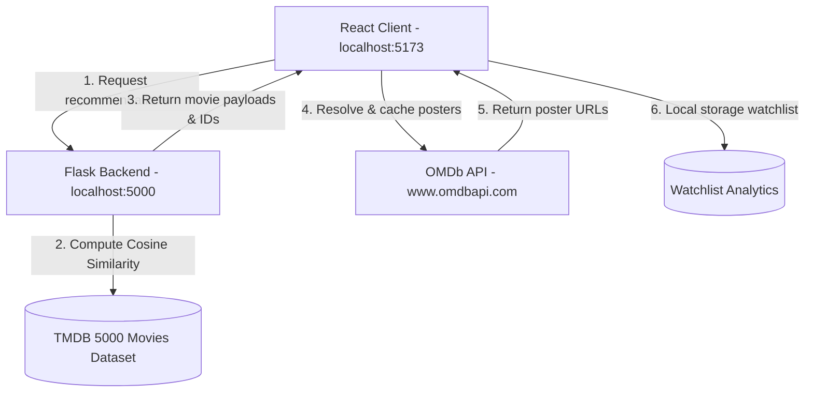

# CineMatch AI 🎬 — AI-Powered Movie Recommendation System

CineMatch AI is a production-grade, Netflix-inspired movie recommendation platform. It combines a **Content-Based Cosine Similarity Recommendation Engine** (Python Flask) with a highly interactive, responsive **Single Page Application (SPA)** (React + Vite).

Featuring unblocked, lightning-fast movie poster rendering powered by the **OMDb API**, and high-quality fallback logic, the application delivers a seamless user experience.

---

## 👥 Creator Details

Developed by **Anmol Kuntal**. Connect with the author or view the repository:
* 📸 **Instagram:** [anmo_lkuntal](https://www.instagram.com/anmo_lkuntal)
* 🐙 **GitHub Repository:** [Movie-Recommendation-System](https://github.com/Anmol8501/Movie-Recommendation-System)

---

## 🌟 Key Features

* **Content-Based Recommendation Engine:** Uses tokenized movie overviews, genres, cast, crew, and keywords processed with NLTK stemming and Scikit-Learn `CountVectorizer` to compute similarity matrices.
* **OMDb API Poster Integration:** Renders high-fidelity movie posters and details directly from unblocked OMDb Amazon S3 endpoints.
* **Lazy Shimmer Image Loaders:** Displays elegant skeleton animations while fetching posters on demand, sliding and fading them in smoothly using Framer Motion.
* **Voice Search Activation:** Glassmorphic search inputs with voice recognition capabilities via the Web Speech API.
* **Watchlist & Analytics Dashboard:** Saves, sorts, and filters favorite movies, visualizing stats (genre frequencies, average ratings, year trends) with interactive Recharts diagrams.
* **Dynamic Pill Mood Selector:** Instantly discover movies that match emotional states (Happy, Emotional, Suspenseful, Romantic, Speculative, Mystery).

---

## 🤖 Machine Learning Model & Recommendation Logic

The backend uses a Content-Based Filtering machine learning pipeline to recommend movies. The entire pipeline is built offline upon server startup inside [app.py](file:///d:/CinemaAI/app.py):

### 1. Data Cleaning & Feature Merging
- Merges the `tmdb_5000_movies.csv` and `tmdb_5000_credits.csv` datasets on the movie `title`.
- Cleans and parses JSON-formatted columns (`genres`, `keywords`, `cast`, `crew`) to extract textual list names.
- Retains only the **top 3 actors** from `cast` and the **Director** name from `crew`.
- Collapses whitespaces within names and tokens (e.g. `Sam Worthington` becomes `SamWorthington`, `Science Fiction` becomes `ScienceFiction`) to prevent tokenizers from treating single entities as separate features.

### 2. Natural Language Preprocessing (Stemming)
- Combines the movie `overview`, `genres`, `keywords`, `cast`, and `director` tokens into a single text block called `tags`.
- Converts the `tags` string to lowercase.
- Tokenizes the text and applies **Porter Stemming** (via NLTK's `PorterStemmer` library) to reduce words to their root forms (e.g., `loved`, `loving`, `loves` all become `love`), avoiding vocabulary redundancy.

### 3. Bag-of-Words Vectorization
- Instantiates a Scikit-Learn `CountVectorizer` configured with a maximum of **5,000 top features** and built-in English stop words removal.
- Transforms the stemmed text blocks into a dense $N \times 5000$ matrix, where $N$ is the number of movies in our database (approx. 4,809).

### 4. Pairwise Cosine Similarity Calculation
- Computes the pairwise cosine similarity matrix across all movie vectors. The similarity between two movie vectors $A$ and $B$ is measured as:
  
  $$\text{similarity}(A, B) = \cos(\theta) = \frac{A \cdot B}{\|A\| \|B\|} = \frac{\sum_{i=1}^{n} A_i B_i}{\sqrt{\sum_{i=1}^{n} A_i^2} \sqrt{\sum_{i=1}^{n} B_i^2}}$$
  
- The output is a symmetric $4809 \times 4809$ matrix containing floating similarity scores between `0.0` (orthogonal/dissimilar) and `1.0` (identical).

### 5. Multi-Route Recommendation Inference
When a query is received by the backend:
1. **Direct Title Search:** It searches for an exact title match (case-insensitive).
2. **Heuristic Spelling Autocorrect:** If no exact match is found, it uses `difflib.get_close_matches` to locate the closest title in the dataset with a 60% similarity threshold (correcting terms like "Avatarr").
3. **Similarity Retrieval:** Once a matching movie is identified, it grabs the corresponding index row in the similarity matrix, sorts the similarity scores descending, and extracts the top $K$ most similar titles (excluding the searched movie itself).
4. **Semantic Vector Search Fallback:** If the query doesn't match any movie title (e.g. user types "space adventure" or "scifi movies"), it vectorizes the search query itself and calculates the cosine distance against all movie vectors (`vector_search`), returning movies containing matching semantic tags.

---

## 🏗️ Project Architecture



---

## 🛠️ Technology Stack

### Backend
* **Language:** Python 3.x
* **Web Server:** Flask (with CORS enablement)
* **NLP & Stemming:** NLTK (PorterStemmer)
* **Machine Learning:** Scikit-Learn (CountVectorizer, cosine_similarity)
* **Data Processing:** Pandas, NumPy, ast, difflib

### Frontend
* **Core:** React 18 + Vite (Production-optimized JS & CSS bundle chunks)
* **Styling & Animations:** Tailwind CSS v3 + Framer Motion v11
* **Icons:** Lucide React
* **Charts:** Recharts
* **Network Queries:** Axios

---

## ⚙️ Quick Start & Installation

### Prerequisite API Keys
You will need an OMDb API Key. Get a free key at [OMDb API](http://www.omdbapi.com/apikey.aspx).

---

### Phase 1: Backend Server Setup

1. **Navigate to the workspace root directory.**
2. **Install Python dependencies:**
   ```bash
   pip install flask flask-cors pandas numpy scikit-learn nltk
   ```
3. **Start the Flask Backend server:**
   ```bash
   python app.py
   ```
   *The server will initialize the recommendation model from the CSV files and listen on `http://localhost:5000`.*

---

### Phase 2: Frontend Client Setup

1. **Navigate to the client directory:**
   ```bash
   cd cinematch-ai
   ```
2. **Install node dependencies:**
   ```bash
   npm install
   ```
3. **Configure Environment Variables:**
   Create a `.env` file in the `cinematch-ai` directory:
   ```env
   VITE_APP_NAME=CineMatch AI
   VITE_APP_URL=http://localhost:5173
   VITE_BACKEND_API_URL=http://localhost:5000
   VITE_OMDB_API_KEY=7d4dc7e4
   ```
4. **Start the Vite development server:**
   ```bash
   npm run dev
   ```
   *Open `http://localhost:5173` in your browser.*

---

## 🔌 Backend REST API Endpoints

The Flask service serves the following REST endpoints on `port 5000`:

* **GET `/api/recommend?movie=<query>&count=<number>`**
  Returns a list of matching and semantically sorted similar recommendations. Includes autocorrect spelling heuristics for queries.
* **GET `/api/trending`**
  Fetches top 20 trending movies sorted by popular rank.
* **GET `/api/movie/<int:movie_id>`**
  Returns details for a single movie based on its dataset ID.
* **GET `/api/discover?genre=<genre_id>&page=<page>`**
  Returns paginated list of movies belonging to specific genres.
* **GET `/api/now_playing?page=<page>`**
  Lists paginated films sorted by release date descending.
* **GET `/api/top_rated?page=<page>`**
  Lists paginated movies sorted by vote average ratings.

---

## ⚠️ Attributions

* **Dataset:** This project uses metadata from the Kaggle TMDB 5000 Movies & Credits datasets.
* **OMDb API:** Poster assets are resolved using the OMDb API and are not officially endorsed or certified.
